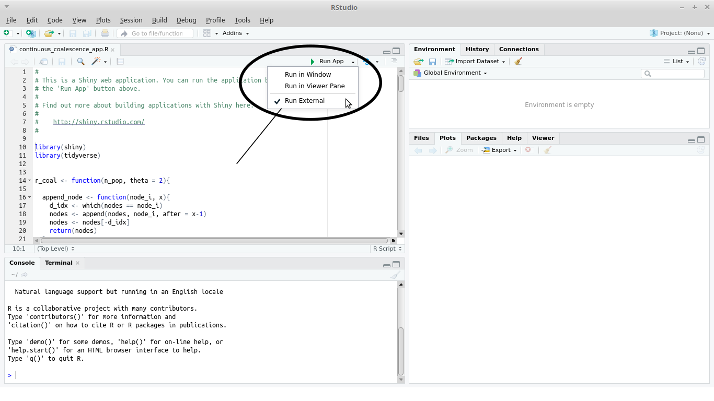

Shiny apps for pop gen courses. 
======================================

Created by Silas Tittes and [Scott Taylor](https://www.colorado.edu/lab/taylor/), for the undergraduate Population Genetics course taught at University of Colorado at Boulder. 
 
This repository consists of multiple sub-directories organized by topic. Each directory has at least one shiny app. Some have multiple. 

Dependencies
-----------

R and RStudio

Additionally, make sure `tidyverse`, `shiny`, and `wesanderson` packages are installed.

```
#get package names
pckgs <- c("tidyverse", "shiny", "wesanderson")

#determine if packages are installed already
miss <- pckgs[!pckgs %in% installed.packages()]

#install missing packages
if(length(miss)) install.packages(miss, dependencies = TRUE)
```

How to run apps
---------------

To run an app, simply open in RStudio and click the "Run App" button. We prefer to use the "Run External" option (see image), which will open the app in your system's default web browser.




Details
-------

* Drift
  * drift_app.R
    * Two-allele drift-only model. Shows fluctuations in allele frequency over discrete generations. Includes option of imposing a bottleneck (without population size recovery).


* Coalescence
  * discrete_time_app.R
    * Discrete-time forward simulation of sampling alleles. Provides option to show trace of ancestry (useful to see if alleles coalesce in time of simulation).
  * continuous_coalescence_app.R
    * Create random genealogies and drop mutations along branches (number of mutations recorded in the small box along branches). Option to hide or show the sequence alignment and genealogy (note columns are individuals). 

* FST
  * fst_app.R
    * Two deme visualization. Randomly samples alleles according to frequencies specified by user. Prints HS, HT, and FST. 


* Selection
  * haploid_selection_app.R
    * Shows change in allele frequency over time due to relative fitness of alleles.
  * diploid_selection_app.R
    * Produces three plot types, average fitness versus allele frequency, change in allele frequency versus allele frequency, and allele frequency over discrete generations.
  * dipoloid_finite_app.R.
    * Traces allele frequencies over discrete generations, where relative fitness of genotypes varies. Like diploid_selection_app.R, but with finite population size. Provides the option to download data, which could be useful for answering questions about fixation probabilities.
  * linked_selection_app.R
    * Compares the effects of background and linked selection on genetic diversity as a function of recombination rate. Based on Chapter 9 of Graham Coop's excellent [popgen-notes](https://github.com/cooplab/popgen-notes).

* STRUCTURE
  * structure.R
    * Not a shiny app, Make plots from STUCTURE output.

* Quant-Gen
  * additive_alleles_app.R
    * A really simple demonstration on how additive alleles contribute to quantitative traits, and rapidly approximate a normal distribution.


Contribute
---------

I would love to expand and improve these. Please submit pull requests and issues, or email me with suggestions. 
silas(dot)tittes(at)gmail(dot)com


Acknowledgments
--------------

Big thanks for contributions from:
- [Liz Scordato](http://www.scordatolab.com/)
- [Tanja Pyhäjärvi](http://www.oulu.fi/pyhajarvilab/research)
- [Yaniv Brandvain](https://brandvainlab.wordpress.com/)
- \<Your name here?\>

